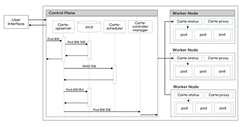
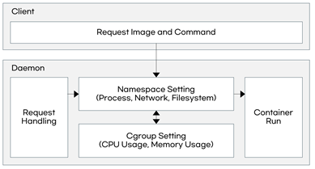
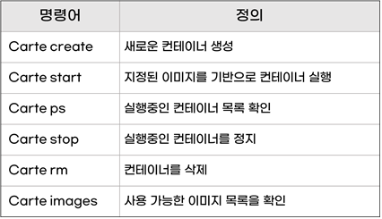
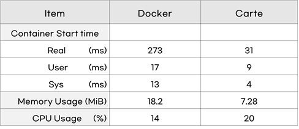
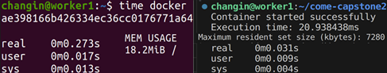
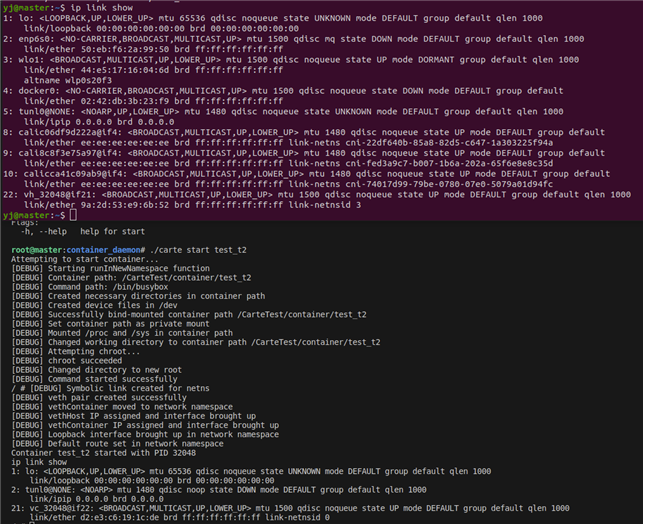
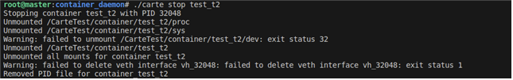

# 한밭대학교 컴퓨터공학과 악동개발자팀

**팀 구성**
- 20211939 허유정
- 20217140 김창인

## <u>Teamate</u> Project Background
- ### 필요성
  - 컨테이너 기술의 등장으로 애플리케이션의 빠른 배포와 확장, 일관된 환경 실행을 요구하는 서버 관리의 효율성이 증대되고 있다.
  - 이에 컨테이너 관리 복잡성 증가로 효율적 운영을 위한 컨테이너 오케스트레이션 도구 필요성이 대두된다.
    
- ### 기존 해결책의 문제점
  - 기존 오케스트레이션 도구는 복잡성과 높은 학습 곡선으로 인해 소규모 프로젝트나 조직에 부담이 된다.
  - 컨테이너 오케스트레이션 제작에 있어 사용자 친화적이며 컨테이너 생성의 최소 요구사항을 충족하는 경량형 컨테이너 서비스 개발을 요구한다.
  
## System Design
  - ### System Requirements
    #### 시스템 구성도

    
    
    - Control Plane
      - 작업 지시 및 상태를 확인하는 컨테이너 간 통신 작업 수행
    - Worker Node
      - 컨테이너 자원 정리 및 네임스페이스 처리 작업 수행

    #### Carte Engine

    

    - Namespace 설정을 통한 프로세스 격리
      - 컨테이너가 독립적으로 동작할 수 있는 격리된 실행 환경 제공

    - Cgroup 설정을 통한 리소스 제한
      - 자원 경쟁 최소화 및 효율적인 리소스 사용

    - 이미지 실행 및 명령 수행
      - 지정된 이미지 사용과 컨테이너 실행 명령을 통한 컨테이너 독립적 동작

    #### Carte 명령어

    

      - Container Life Cycle을 기준으로 생성하였으며 기존 기술보다 명령어를 간소화시켜 사용자 입장에서 유용한 사용을 하도록 구성함

    
## Case Study
  - #### 기존 도구와의 비교
    

    
    

  
## Conclusion

  - 완성품

    

    

  - 기대효과

    - 소규모 프로젝트나 조직에 부담되지 않는 경량화된 서비스 개발로 효율적인 메모리 관리와 생산성을 향상시킬 것으로 기대됨
    - 서버 배포, 관리 및 확장의 자동화로 개발자들은 유연하고 경제적인 서버 운영이 가능할 것으로 기대됨
    - 컨테이너 기술 교육 자료로 활용하여 실습 중심의 학습을 하는 학생들에게 인프라 관리 기술을 가르치는데 유용한 도구가 될 수 있을 것으로 기대됨
  
## Project Outcome
- ### 2024춘계공동학술대회 
  - 이산사건 시스템 형식론 기반 컨테이너 분산 예측 방법론
  - AI통합 지능형 오케스트레이션 방법론: IoT 서비스 최적화 설계
  
- ### 2024한국전기전자학회
  - 효율적인 컨테이너 오케스트레이션 관리를 위한 컨테이너 이미지 최적화 기법
  - 제한된 컴퓨터 환경을 위한 경량 컨테이너 런타임 엔진: Docker와의 비교 연구

- ### 2024한국정보기술학회
  - 컨테이너 관리 시스템의 안정성 향상을 위한 자원 해제 자동화 및 오류 복구 기법
  - 엣지 컴퓨팅 환경을 위한 경량화 컨테이너 런타임 설계 및 성능 검증

- ### 2024시뮬레이션학회
  - 이산 사건 시스템 형식론 기반의 컨테이너 자원 복구 전략 및 예측 방법론
  - 경량형 컨테이너 기반 WebRTC 원격 로봇 제어 시스템의 설계 및 시뮬레이션
